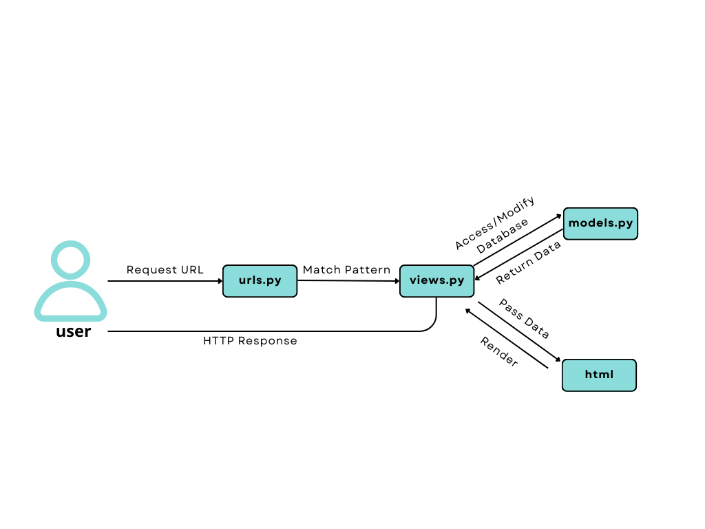
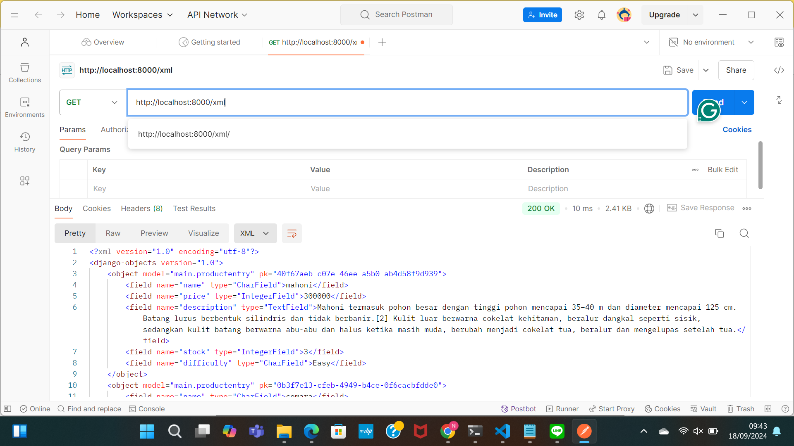
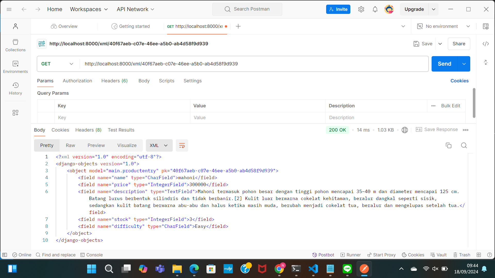
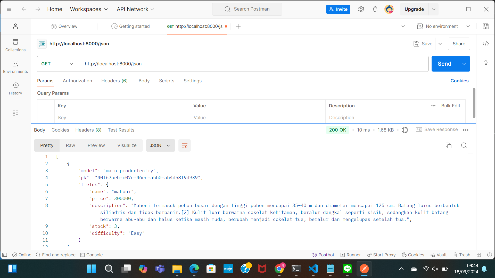
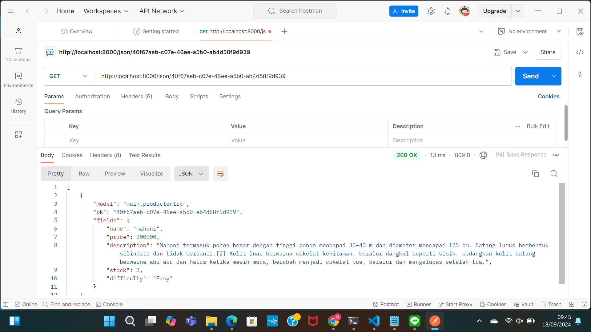

Nama : Nelil Amaani
NPM : 2306227835
Kelas : PBP B
web: http://nelil-amaani-plantshop.pbp.cs.ui.ac.id/

1. Jelaskan bagaimana cara kamu mengimplementasikan checklist di atas secara step-by-step (bukan hanya sekadar mengikuti tutorial)
1.) Membuat sebuah proyek Django baru
dalam hal ini saya membuat program Django bernama plantshop yang berada pada subdirektori bernama plantshop. keduanya saya hubungkan dengan repository di GitHub untuk memudahkan version control
2.)  Membuat aplikasi dengan nama main pada proyek tersebut
saya menambahkan menambahkan aplikasi main ke dalam proyek dengan melakukan perintah di CMD python manage.py startapp main. Main kemudian didaftarkan ke dalam file setting.py proyek dibawah INSTALLED_APPS agar terhubung dengan proyek utama.
3.)  Melakukan routing pada proyek agar dapat menjalankan aplikasi main.
agar dapat menjalankan aplikasi main, saya menambahkan file urls.py dalam proyek utama dan menambahkan rute untuk mengarahkan URL ke aplikasi main.
from django.urls import include, path

urlpatterns = [
    path('main/', include('main.urls')),  # Mengarahkan ke aplikasi main
]
4.) Membuat Model Product pada Aplikasi main
pada file models.py dalam aplikasi main, saya mendefinisikan Product dengan atribut name, prive, dan description. Model ini akan digunakan untuk mempresentasikan produk dalam database.
class Product(models.Model):
    name = models.CharField(max_length=100)  # Nama tanaman
    price = models.IntegerField()  # Harga tanaman
    description = models.TextField()  # Deskripsi tanaman
    stock = models.IntegerField(default=0)  # Stok tanaman
    difficulty = models.CharField(
        max_length=20, choices=[('Easy', 'Easy'), ('Medium', 'Medium'), ('Hard', 'Hard')], default='Medium'
    )  # Tingkat perawatan
    image_url = models.URLField(null=True, blank=True)  # URL gambar tanaman

    def __str__(self):
        return self.name

5.) Membuat Fungsi di views.py untuk Menampilkan Data di Template
membuat fungsi show_info di file views.py yang dapat mengembalikan informasi nama aplikasi, nama, dan kelas. Fungsi tersebut akan mengembalikan data ke dalam file template main.html, file template html yang saya buat:
from django.shortcuts import render

def show_main(request):
    context = {
        'app_name': 'PlantShop',
        'npm' : '2306123456',
        'name': 'Nelil Amaani',
        'class': 'PBP B',
    }
    return render(request, 'main/main.html', context)

6.) Membuat Routing di urls.py Aplikasi main
Membuat file urls.py dalam aplikasi main dan menambahkan rute untuk memetakan show_info yang telah di buat dalam file views.py. yang sudah saya buat:
from django.urls import path
from main.views import show_main

app_name = 'main'

urlpatterns = [
    path('', show_main, name='show_main'),
    
]

7.) Melakukan Deployment ke PWS
Setelah aplikasi selesai saya melakukan deployment ke platform PWS. 
pertama saya mengakses situs di https://pbp.cs.ui.ac.id, login, lalu buat proyek baru degan nama plantshop,setelah proyek dibuat, simpan credentials proyek untuk digunakan dalam deployment nanti.
pada file setting.py tambahkan URL deployment PWS dengan format <username-sso>-<nama-proyek>.pbp.cs.ui.ac.id , pastikan lakukan git add, git commit, dan gitpush ke GitHub terlebih dahulu
lalu jalamkan perintah git push pws main:master menggunakan credentials yang sudah disimpan dari PWS. Setelah melakukan push, cek status deployment di PWS. jika statusya "Buillding", proyek masih diproses; apabila "Running", proyek sudah dapat diakses melalui URL deployment.
8.) Membuat README.md
saya membuat file README.md yang berisi:
Tautan menuju aplikasi yang sudah di-deploy di PWS,
Penjelasan tentang bagaimana cara saya mengimplementasikan checklist di atas secara step-by-step,
Jawaban atas beberapa pertanyaan terkait

2. Buatlah bagan yang berisi request client ke web aplikasi berbasis Django beserta responnya dan jelaskan pada bagan tersebut kaitan antara urls.py, views.py, models.py, dan berkas html.
client melakukan request ->  urls.py (mencocokan URL) -> views.py (menjalankan logika aplikasi) -> models.py (mengambil data dari database) -> views.py (memproses data) -> Template (main.html) -> Respons kembali ke client


3. Jelaskan fungsi git dalam pengembangan perangkat lunak!
1.) Git memfasilitasi berkolaborasi dengan banyak pengembang yang bekerja dalam proyek yang sama tanpa saling menggangu.
2.) Git memudahkan pengembang untuk melacak perubahan kode yang terjadi seiring waktu.
3.) Git dapat menjadi backup dan dapat melakukan pemulihan dengan mudah, karena perubahan kode disimpan pada lokal dan disinkronkan ke repositori jarak jauh seperti GitLab atau GitHub.
4.) Git memberikan riwayat perubahan dan transparansi mengenai siapa dan kapan yang melakukan perubahan kode.

4. Menurut Anda, dari semua framework yang ada, mengapa framework Django dijadikan permulaan pembelajaran pengembangan perangkat lunak?
1.) Django memiliki dokumentasi yang lengkap dan dapat dengan mudah dipahami oleh pemula.
2.) Django dibangun dengan bahasa python, bahasa yang mudah untuk dipelajari, yang membuat  ideal untuk pengembangan web.
3.) Django dapat mengembangkan aplikasi mulai dari yang sederhana maupun kompleks.
4.) Django menerapkan pola MVT (Model-View-Template) yang dapat memudahkan pengembang logika aplikasi, data, dan tampilan dalam struktur yang terorganisir.
5.) Django dilengkapi fitur keamanan bawaan yang memiliki perlindungan yang kuat seperti CSRF, SQL injection, dan XSS dll.
6.) Django merupakan salah satu framework yang banyak digunakan di seluruh dunia, sehingga memudahkan menemukan tutorial, forum/komunitas, dan bantuan ketika menemui masalah.

5. Mengapa model pada Django disebut sebagai ORM?
model pada Django disebut sebagai ORM (Object-Relational Mapping) karena model tersebut menggunakan pendekatan pemetaan object python ke dalam struktur basis data relasional, sehingga memungkinkan developer untuk berinteraksi dengan basis data dengan menggunakan object python tanpa perlu membuka SQL secara langsung.
______________________________________________________________________________________________________
1. Jelaskan mengapa kita memerlukan data delivery dalam pengimplementasian sebuah platform?
data delivery diperlukan dalam implementasi sebuah platform karena untuk mengahsilkan dan mendapatkan data yang dapat diakses, dikirim, dan diterima oleh pengguna dan komponen dengan cara yang aman dan efisien. Ada beberapa alasan mengapa data delivery itu penting:
1.) Koneksi antar komponen
Data delivery memungkinkan komponen-komponen saling bertukar informasi secara real-time sehingga platform dapat berfungsi dengan baik.
2.) Pengambilan keputusan yang tepat waktu
pengiriman data secara real-time memungkinkan perusahaan untuk mengakses dan menganalisi data saat data tersebut dihasilkan, sehingga perusahaan dapat membuat keputusan yang cepat dan tepat.
3.) Pengalaman pelanggan yang lebih baik
Sistem data delivery memastikan pengambilan dan pengiriman data dapat berjalan dengan lancar, sehingga memungkinkan pengguna mendapatkan data yang relevan dan tepat waktu.
4.) Keamanan data
Data delivery berguna untuk memastikan data dapat terkirim dengan aman melalui enkripsi dan juga autetifikasi, sehingga dapat memastikan keamanan pengguna.

2. Menurutmu, mana yang lebih baik antara XML dan JSON? Mengapa JSON lebih populer dibandingkan XML?
Dalam berbagai kasus, JSON dianggap lebih baik daripada XML. Berikut alasannya:
1.) JSON memiliki struktur yang ringkas, sehingga JSON menghasilkan file yng lebih kecil daripada XML yang memiliki tag pembuka dan penutup, sehingga memiliki struktur yang lebih verbose(panjang).
2.) JSON mudah diparsing oleh berbagai bahasa pemograman, khususnya JavaSCript. Sedangkan XML membutuhkan parser yang lebih komplex dengan SAX parsers atau DOM parsers, yang membutuhkan banyak sumberdaya dan memori.
3.) JSON cocok dengan JavaScript yang merupakan bahasa utama untuk pengembangan web. sedangkan XML bisa menggunakan JavaScript tetapi perlu informasi tambahan untu menjadi object JavaScript.
4..) JSON memiliki struktur yang sederhana dengan objek, array, dan nilai dasar yang dapat dipahami pengguna. sedangkan, XML memiliki atribut, nameespace, dan skema yang lebih kompleks yang dapat membingungkan pengguna.

JSON lebih populer dibanding XML karena memiliki struktur yang lebih ringkas sehingga lebih cepat untuk diproses, JSON juga lebih kompatibel dengan teknologi web modern, terutama dalam koneksi antara server dan aplikasi web. Namun, di satu sisi XML masih memiliki keunggulan seperti dokumen dengan struktur yang lebih kompleks, sehingga validasi data lebih ketat.

3. Jelaskan fungsi dari method is_valid() pada form Django dan mengapa kita membutuhkan method tersebut?
is_valid merupakan sebuah method yang bekerja dengan form. Method ii berguna untuk melakukan validasi data yang dikirim pengguna melalui form. Method is_valid() pada django memiliki beberapa fungsi penting dalam pengelolaan form: 
1.) melakuakan validasi data yang dikirim pengguna.
2.) is_valid() dapat memicu proses pembersihan data melalui method clean() yang terdapat pada form tertentu atau yield tertentu. Method ini membersikan data agar aman dan sesuai untuk pemrosesan lanjut atuu penyimpanan dalam database.
3.) Jika  ketemukan data yang tidak valid atau kesalahan, method ini akan mengumpulkan pesan eror dan menampilkan kepada pengguna agar pengguna dapat memperbaiki input yang salah.

kita membutuhkan method is_valid() karena beberapa alasan
1.)keamanan
validasi melalui is_valid() dapat membantu serangan yang berbahaya seperti cross-site scripting atau SQL injection dengan memastikan data yang diinput pengguna sudah divalidasi dengan benar, sehingga data yang masuk bersih dari kode berbahaya.
2.) Integritas data
validasi melalui is_valid() memastikan bahwa data yang masuk ke dalam sistem merupakan data yang sesuai dengan aturan bisnis yang telah disepakati dan ditentukan.
3.) Pengalaman pengguna lebih baik
validasi melalui is_valid() dapat memberikan feedback jika terjadi kesalahan input dan akan menampilkannya pada pengguna, sehingga pengguna dapat mengetahui kesalahan apa yang perlu diperbaiki.


4. Mengapa kita membutuhkan csrf_token saat membuat form di Django? Apa yang dapat terjadi jika kita tidak menambahkan csrf_token pada form Django? Bagaimana hal tersebut dapat dimanfaatkan oleh penyerang?

Mengapa kita membutuhkan csrf_token saat membuat form di Django? 
csrf_token merupakan token yang unik yang dihasilkan server dan disisipkan ke setap form HTML. Token ini dikirim bersama form untuk memastikan bahwa permintaan dikirim dari penguna yang sah bukan dari pihak eksternal yang mencoba untuk masuk. Django hanya memproses token yang valid dan terikat dengan sesi pengguna yang aktif.
csrf_token dapat mencegah serangan berbahaya, memverivikasi asal permintaan, dan meningkatkan keamamana aplikasi.

Apa yang dapat terjadi jika kita tidak menambahkan csrf_token pada form Django?
tanpa csrf_token, aplikasi menjadi lebih rentan terhadap serangan Site Request Forgery (CSRF), penyerang dapat mengirimkan permintaan atas nama pengguna sah tanpa sepengetahuanya. Hal tersebut dapat menyebabkan perubahan data, seperti perubahan pengaturan akun dan transaksi yang berbahaya.

Bagaimana hal tersebut dapat dimanfaatkan oleh penyerang?
Penyerang dapat membuat halaman web atau scrip dengan memanfaatkan sesi pengguna sah untuk mengirim permintaan berbahaya ke server. Dengan tidak adanya  csrf_token, aplikasi tidak bisa membedakan permintaan yang berasal dari pengguna sah atau dari penyerang. Sehingga permintaan berbahaya tersebut dapat terproses dengan mudah.

5. Jelaskan bagaimana cara kamu mengimplementasikan checklist di atas secara step-by-step (bukan hanya sekadar mengikuti tutorial).

membuat sebuah file base.html di dalam direktori templates yang akan berfungsi sebagai kerangka umum untuk tempalte dasar. lalu daftakan kerangka tersebut di TEMPLATES pada setting.py. Lalu kita tambahkan UUID setiap object di model.py . kemudian, lakukan migrasi model dengan menjalankan
python manage.py makemigrations
python manage.py migrate
Langkah selanjutnya kita membuat form input yang ditampilkan pada html. pertama, kita membuat forms.py untuk membuat fields di modelnya. kemudian pada views.py ditambahkan fungsi untuk memvalidasi data input dan mengirimkannya dari forms.py ke database. Pada show_main, tambahkan data entries ke dalam context agar data yang sudah diinput dapat ditampilakan saat ada permintaan. Langkah selanjutnya, daftrakan path URL di urls.py untuk mengakses fungsi. Membuat file create_product_entry.html dalam folder main/templates yang berfungsi untuk mengirimkan data melalui metode POST. Kemudian, tambahkan main.html untuk menampilkan form input yang sudah dibuat.

Langkah selanjutnya yaitu menampilkan data dalam format XML dan JSON. pada view.py kita membuat fungsi yang dapat mengubah object menjadi format XML dan JSON dengan mengembalikan HTTP response yang sesuai. Kemudia buat dua fungsi lain yang menampilkan ID dalam format XML dan JSON. dengan demikian akan ada empat fungsi yang kita punta yaitu: 
show_xml, show_json, show_xml_by_id, dan show_json_by_id. Kemudian kita tambahkan path URL di urls.py untuk routing masing-masing fungsi tersebut.

Terakhir gunakan Postman sebagai alat untuk melihat data yang dihasilkan, Misalnya untuk melihat formaat XML cukup kirimkan permintaan URL seperti http://localhost:8000/xml/. Postman akan menampilan object yang sudah dibuat dalam format XML yang diminta.







<<<<<<< HEAD
terima kasih
______________________________________________________________________________________________________
TUGAS 4
1.  Apa perbedaan antara HttpResponseRedirect() dan redirect()
HttpResponseRedirect:
- mengembalikan secara langsung objek HttpResponseRedirect, yang merupakan jenis respons HTTP khusus yang menunjukkan redirect sementara (kode status HTTP 302).
-Memerlukan URL string sebagai argumen.

redirect:
-mengembalikan objek HttpResponseRedirect atau HttpResponsePermanentRedirect, tergantung pada parameter yang diberikan, untuk redirect permanen dan kode status HTTP 301.
-Lebih fleksibel dan dapat menerima berbagai jenis input seperti nama tampilan, model instance, dan URL absolut atau relatif.

2. Jelaskan cara kerja penghubungan model Product dengan User!
ForeignKey dapat digunakan untuk membangun hubungan antara model produk dan model pengguna Django, yang memungkinkan setiap produk terhubung dengan satu pengguna, yang memungkinkan pengelolaan data yang lebih efisien, dan memungkinkan satu pengguna memiliki banyak produk dan dapat mengaksesnya dengan mudah melalui relasi yang telah dibuat.

3. Apa perbedaan antara authentication dan authorization, apakah yang dilakukan saat pengguna login? Jelaskan bagaimana Django mengimplementasikan kedua konsep tersebut.

-Proses authentication, juga dikenal sebagai otentikasi, adalah proses yang memastikan bahwa seseorang yang mengakses aplikasi adalah orang yang sebenarnya. Tujuan utama otentikasi adalah untuk memastikan bahwa pengguna yang masuk ke sistem adalah orang yang sebenarnya dan bukan pengguna palsu.
-Authorization adalah proses yang mengatur apa yang dapat dilakukan oleh pengguna yang telah diotentikasi. Setelah pengguna melakukan autentikasi, otorisasi akan menentukan hak akses pengguna, seperti kemampuan untuk melihat, mengubah, atau menghapus.

Saat pengguna masuk, hal-hal berikut terjadi:
-Identification: Pengguna memasukkan identitasnya, seperti username dan password. 
-Authentication: Sistem membandingkan identitas pengguna dengan data di database untuk memastikan apakah identitas tersebut benar. Jika verifikasi berhasil, pengguna dinyatakan telah otentikasi.
-Authorization: Setelah pengguna otentikasi, sistem akan menentukan hak akses pengguna. Ini biasanya dicapai dengan memberikan pengguna peran untuk melakukan tindakan yang sesuai dengan peran mereka.

Jelaskan bagaimana Django mengimplementasikan kedua konsep tersebut?
Modul django.contrib.auth dari Django menangani proses autentikasi dan otorisasi. Modul ini memiliki fungsi untuk memverifikasi pengguna dan menentukan hak akses mereka.

4.  Bagaimana Django mengingat pengguna yang telah login? Jelaskan kegunaan lain dari cookies dan apakah semua cookies aman digunakan?

Django mengingat pengguna yang telah login dengan menggunakan session dan cookies.
Cara Django Mengelola Sesi -  Session Management: Setelah pengguna masuk ke aplikasi, Django membuat sesi untuk mereka, yang digunakan untuk menyimpan informasi pengguna selama mereka berinteraksi dengan aplikasi. Ini dilakukan dengan menggunakan session ID yang disimpan dalam cookies di sisi klien. Setiap kali pengguna melakukan permintaan ke server, session ID ini dikirimkan ke server untuk mengidentifikasi sesi pengguna.
- Cookies: Cookie adalah file data kecil yang disimpan di browser pengguna. Ketika pengguna login, Django dapat menyimpan ID sesi dalam cookie ini. Cookie ini akan dikirim ke server pada setiap permintaan berikutnya, memungkinkan Django untuk mengaitkan permintaan tersebut dengan sesi yang tepat.

Kegunaan Lain dari Cookies:

-Pelacakan untuk Pengguna: Untuk analisis dan pengoptimalan pengalaman pengguna, cookies digunakan untuk melacak aktivitas pengguna di situs, seperti halaman yang dikunjungi.
-Menjaga Preferensi:Cookie dapat menyimpan preferensi pengguna, seperti bahasa dan tema tampilan, sehingga pengguna tidak perlu mengatur ulang setiap kali mereka mengunjungi situs web.

Apakah Semua Cookies Aman?
tidak semua cookies aman, Beberapa pertimbangan keamanan:

-Cookies hanya untuk HttpOnly:Dengan menghindari serangan XSS (Cross-Site Scripting), cookie ini tidak dapat diakses melalui JavaScript. Untuk cookies yang menyimpan data pribadi, sangat disarankan untuk menggunakan fitur HttpOnly.
-Secure Cookies:Hal ini hanya memungkinkan pengiriman cookie melalui protokol HTTPS, yang melindungi data saat dikirim.
-Data yang sensitif:Hindari menyimpan data sensitif, seperti kata sandi, dalam cookies; sebaliknya, gunakan sesi.
-Kertas Cookie dari Pihak Ketiga:Cookie yang dibuat oleh situs web lain (misalnya, iklan) dapat membahayakan privasi Anda. Pastikan bahwa pengguna memahami penggunaan cookies ini.
-Waktu kedaluwarsa cookie:Tingkatkan risiko dengan menetapkan tanggal kedaluwarsa untuk cookies agar tidak aktif lebih lama dari yang diperlukan.

5.Jelaskan bagaimana cara kamu mengimplementasikan checklist di atas secara step-by-step (bukan hanya sekadar mengikuti tutorial).

Pertama, aktifkan virtual environment. Kemudian, cari views.py di subdirektori main dan tambahkan import ke UserCreationForm dan messages. Selanjutnya, buat fungsi register untuk menangani pendaftaran pengguna, termasuk validasi form dan penyimpanan data pengguna baru. Selain itu, buat berkas register.html untuk menampilkan form. Selanjutnya, gunakan dekorator @login_required untuk melindungi halaman utama; tambahkan fungsi login_user untuk autentikasi pengguna dan logout_user untuk menghapus sesi pengguna saat logout. Selain itu, tambahkan cookie last_login saat pengguna login dan hapus cookie tersebut saat logout. Modifikasi model ProductEntry untuk menghubungkan setiap entri dengan pengguna yang membuatnya. Selain itu, fungsi create_product_entry dan show_main disesuaikan untuk menampilkan data hanya sesuai dengan pengguna yang dimaksud. Selanjutnya, lakukan migrasi model dan sesuaikan nilai field user default. Akhirnya, tambahkan variabel PRODUCTION dan ubah DEBUG di settings.py. Dengan mengikuti langkah-langkah ini akan memulai sistem autentikasi yang berhasil, yang akan memungkinkan pengguna mendaftar, login, dan melihat informasi akun.
=======
terima kasih
--------------------------------------------------------------------------------------------------------------------
1.  Jika terdapat beberapa CSS selector untuk suatu elemen HTML, jelaskan urutan prioritas pengambilan CSS selector tersebut!
1). Inline Styles: atribut style merupakan aturan yang mendapatkan prioritas tinggi dalam aturan CSS yang diterapkan langsung di elemen HTML.
 
<div style="color: red;">Text</div>

2). ID Selector: selector yang menggunakan id memiliki prioritas tinggi daripada class atau element selector

#myID {
  color: blue;
}

3). Class, Pseudo-class, dan Attribute Selector: selector berdasarkan class, pseudo seperti :nth-child dan :hover, dan atribut seperti [type="text"] 
memiliki prioritas yang tinggi daripada element selector, namun memiliki prioritas dibawah ID selector.

.myClass {
  color: green;
}


4).Element dan Pseudo-element Selector: selector seperti div, p, a, ::before, dan ::after memiliki prioritas yang rendah.

p {
  color: black;
}

5). Important Rule: Deklarasi dengan !important akan mengesampingkan aturan, meskipun tingkat prioritasnya lebih rendah. Namun, jika ada dua aturan yang menggunakan !important, aturan yang ditetapkan yaitu yang memiliki tingkat prioritas paling tinggi.

6.) Cassade Order: jika ada dua aturan yang memiliki tingkat prioritas yang sama, maka aturan yang ditulis terakhir dalam file CSS akan diterapkan.

sumber: https://blogs.halodoc.io/best-practices-that-we-follow-to-avoid-specificity-issues/#:~:text=CSS%20specificity%20rule&text=Below%20are%20the%20order%20of,These%20selectors%20has%20lowest%20priority.

2. Mengapa responsive design menjadi konsep yang penting dalam pengembangan aplikasi web? Berikan contoh aplikasi yang sudah dan belum menerapkan responsive design

berikut beberapa alasan mengapa  responsive design menjadi konsep yang penting dalam pengembangan aplikasi web:

1). Pengalaman Pengguna yang Terbaik: Desain responsif memastikan konten dapat dibaca dan dinavigasi dengan mudah di berbagai ukuran layar tanpa menggulir terlalu banyak, karena semakin banyak pengguna yang mengakses internet melalui perangkat mobile. Ini meningkatkan kepuasan pengguna dan mengurangi tingkat pentalan.
2). Meningkatkan SEO: Google lebih suka situs yang responsif karena mereka menawarkan pengalaman pengguna yang lebih baik dan memiliki peringkat yang lebih baik di hasil pencarian, yang menghasilkan peningkatan visibilitas dan trafik.
3). Efisiensi Pengembangan: Menghasilkan satu versi situs yang responsif menghemat waktu dan sumber daya karena tidak perlu membuat dan memelihara berbagai versi situs untuk berbagai perangkat.
4). Fleksibilitas dan Aksesibilitas:Komponen halaman seperti teks dan gambar dapat menyesuaikan diri secara otomatis dengan ukuran layar, sehingga konten tetap jelas dan terorganisir.\

sumber: https://revou.co/kosakata/responsive-web-design
https://www.dicoding.com/blog/dasar-tampilan-responsif-pada-website/

3. Jelaskan perbedaan antara margin, border, dan padding, serta cara untuk mengimplementasikan ketiga hal tersebut!

Margin
definisi:Margin adalah ruang kosong di luar elemen yang memisahkan elemen dari elemen lain di sekitarnya. Margin hanya mengontrol jarak antar elemen di luar batas elemen itu sendiri.
Fungsi: Margin digunakan untuk mengatur jarak antara elemen dan elemen-elemen lain yang mengelilingi mereka.
cara implementasi:dapat mengubah batas dengan menggunakan properti CSS seperti margin-top, margin-right, margin-bottom, dan margin-left.
contoh:
margin: 10px; // Margin sama di semua sisi
margin-top: 5px;
margin-right: 10px;
margin-bottom: 15px;
margin-left: 20px; // Margin berbeda untuk setiap sisi

Border
definisi: Border merupakan garis pembatas yang terletak di antara margin dan padding
Fungsi:Untuk mengatur gaya, ketebalan, dan warna garis yang mengelilingi padding dan konten elemen
cara implementasi: Dengan menggunakan properti CSS seperti border-width, border-style, dan border-color dapat mengubah batas.
contoh:
border: 3px solid #000; // Ketebalan 3px, gaya solid, warna hitam
border-width: 5px;
border-style: dashed;
border-color: #FF0000; // Ketebalan 5px, gaya dashed, warna merah

Padding
Definisi: Padding adalah ruang di antara konten suatu elemen dan batas atau border.
Fungsi:Padding membuat konten lebih mudah dibaca dan memberikan tampilan yang lebih rapi dengan mengontrol jarak antara konten d
cara implementasi:Dengan menggunakan properti CSS seperti padding-top, padding-right, padding-bottom, dan padding-left.
Contoh:
padding: 20px; // Padding sama di semua sisi
padding-top: 30px;
padding-right: 40px;
padding-bottom: 50px;
padding-left: 60px; // Padding berbeda untuk setiap sisi

4. Jelaskan konsep flex box dan grid layout beserta kegunaannya
Flexbox
konsep: Flexbox merupakan metode tata letak yang memungkinkan pengaturan elemen satu dimensi baik dalam baris horizontal maupun kolom vertikal. Flexbox merupakan pilihan yang tepat Untuk tata letak elemen yang memiliki hubungan dinamis dan membutuhkan distribusi ruang yang fleksibel. Elemen dapat diatur dalam baris atau kolom di mana mereka secara otomatis menyesuaikan diri dengan ruang yang tersedia. 
Kegunaan: 
-Mengatur elemen dalam tata letak baris atau kolom dalam satu dimensi
-Memungkinkan elemen secara otomatis didistribusikan dan diselaraskan dalam container, seperti elemen dalam navbar atau layout card
-sangat responsif untuk mengatur tata letak yang berubah sesuai ukuran layar

Grid Layout
konsep: Tata letak grid CSS adalah metode tata letak dua dimensi yang memungkinkan Anda mengatur elemen dalam baris dan kolom secara bersamaan. Tata letak grid memungkinkan Anda mengatur bagaimana elemen diposisikan di kedua sumbu, vertikal dan horizontal, sehingga sangat berguna untuk mengelola tata letak yang lebih kompleks seperti struktur halaman penuh.
Kegunaan:
-Mengatur elemen dalam tata ltak baris atau kolom dalam dua dimensi
-Menentukan berapa banyak baris dan kolom yang diperlukan, serta cara elemen ditempatkan di dalam grid, memungkinkan Anda mengontrol sepenuhnya tata letak elemen di grid
-Sangat sesuai untuk desain yang lebih kompleks, seperti layout halaman web yang terdiri dari header, sidebar, konten utama, dan footer


5. Pertama, tambahkan fungsi edit_product dan delete_product ke views.py. Kemudian, lakukan routing url untuk mengakses fungsi yang telah dibuat sebelumnya. Kemudian gunakan tailwind untuk membuat template. Menggabungkan CDN (Content Delivery Network) ke bagian head. Selanjutnya, buat navbar.html untuk aplikasi desktop dan mobile. Setelah itu, masukkan middleware WhiteNoise untuk memberi Django kemampuan untuk mengelola file statis. Styling login.html, registrasi.html, kartu_produk.html, membuat_entry_produk.html, dan edit_product.html dengan tailwind. Apabila Anda membutuhkan file statis, tambahkan load static pada awal setiap file.


--------------------------------------------------------------------------------------------------
## Tugas 6

Berikut adalah versi yang lebih santai dari teks yang kamu berikan, namun tetap formal:

---

Keuntungan Menggunakan JavaScript dalam Pengembangan Web

JavaScript menawarkan banyak manfaat dalam pengembangan web, di antaranya:

- Interaktivitas: JavaScript memungkinkan kita membuat elemen-elemen interaktif di halaman web, seperti dropdown, slider, validasi form, dan popup modal, yang tentunya membuat pengalaman pengguna jadi lebih menarik.
  
- Manipulasi DOM: Dengan JavaScript, kita bisa mengubah elemen-elemen di halaman web secara dinamis, misalnya menambah, menghapus, atau mengedit konten tanpa harus reload halaman.
  
- Komunikasi Asinkron: Berkat fitur seperti `XMLHttpRequest` atau `fetch()`, JavaScript mendukung komunikasi asinkron dengan server (melalui AJAX). Ini artinya, aplikasi bisa merespons tanpa perlu melakukan reload halaman penuh.
  
- Kompatibilitas Platform Lain: JavaScript dapat berjalan di hampir semua browser modern, sehingga kode yang kita tulis bisa diakses di berbagai perangkat dan platform.
  
- Mendukung Pengembangan SPA (Single Page Application): Framework atau library seperti React, Angular, dan Vue memudahkan pengembangan SPA, yang membuat aplikasi lebih cepat karena hanya bagian tertentu dari halaman yang diperbarui.

Peran `await` dalam `fetch()`

`await` digunakan untuk menunggu hasil dari fungsi asynchronous seperti `fetch()`. Ini memastikan eksekusi kode berikutnya tidak berjalan hingga hasil dari `fetch()` diterima.

- Fungsi utama `await`: `await` memudahkan penulisan kode asynchronous dengan tampilan yang lebih rapi, mirip dengan fungsi synchronous. Dengan `await`, kode setelahnya baru akan dijalankan setelah proses `fetch()` selesai, membuat kode lebih mudah dipahami tanpa perlu menggunakan callback atau `.then()`.
  
- Jika `await` tidak digunakan: Jika tidak memakai `await`, `fetch()` akan mengembalikan sebuah *Promise* yang belum selesai, dan kode berikutnya akan dieksekusi sebelum hasil dari fetch tersedia. Ini bisa menimbulkan masalah, seperti data yang belum siap diproses lebih lanjut.

Contoh tanpa `await`:
```javascript
const response = fetch('url'); // Mengembalikan Promise
const data = response.json();   // Kode ini dieksekusi sebelum response selesai
```

Contoh dengan `await`:
```javascript
const response = await fetch('url');
const data = await response.json(); // Menunggu hingga response selesai
```
Penggunaan Decorator `csrf_exempt` pada View untuk AJAX POST

Decorator `@csrf_exempt` digunakan untuk mengecualikan view dari mekanisme perlindungan Cross-Site Request Forgery (CSRF). Di Django, mekanisme CSRF ini ada untuk melindungi aplikasi dari serangan di mana pengguna tanpa sadar bisa mengirimkan request berbahaya.

Namun, saat melakukan POST request dengan AJAX, token CSRF kadang tidak otomatis disertakan. Hal ini bisa menyebabkan error saat POST request dikirim tanpa token CSRF yang valid. Dengan menambahkan `@csrf_exempt` pada view, kita memberi tahu Django untuk tidak melakukan pengecekan CSRF pada request tersebut.

Note, penggunaan `@csrf_exempt` harus sangat hati-hati karena bisa membuka celah keamanan. Sebaiknya, token CSRF disertakan secara eksplisit dalam request AJAX sebagai alternatif yang lebih aman.

Mengapa Validasi Data Pengguna Sebaiknya Dilakukan di Backend

Validasi input dari pengguna sangat penting dilakukan di sisi backend karena beberapa alasan utama:

- Keamanan: Validasi yang hanya dilakukan di frontend bisa dengan mudah dimanipulasi oleh pengguna, misalnya dengan mematikan JavaScript atau mengedit kode halaman. Oleh karena itu, backend perlu memvalidasi untuk melindungi aplikasi dari serangan, seperti injeksi kode atau pengiriman data yang tidak valid.
  
- Keuntungan: Frontend adalah bagian yang bisa dimodifikasi pengguna, sehingga backend harus punya mekanisme validasi sendiri untuk memastikan aplikasi tetap berjalan dengan benar meskipun frontend telah dimodifikasi.
  
- Best Practices: Validasi yang ideal dilakukan di kedua sisi, baik frontend untuk memberikan pengalaman pengguna yang lebih cepat, dan di backend untuk menjamin keamanan serta integritas data.

Step by Step Implementasi

## AJAX `GET`

1. Agar product card bisa menggunakan AJAX `GET`, kita perlu menambahkan block kode product card ke dalam fungsi asinkron `refreshProducts()` di `main.html`, seperti berikut:
   
```javascript
async function refreshProducts() {
    document.getElementById("product_cards").innerHTML = "";
    document.getElementById("product_cards").className = "";
    const Products = await getProducts();
    let htmlString = "";
    let classNameString = "";
    
    if (Products.length === 0) {
        classNameString = "flex flex-col items-center justify-center min-h-[24rem] p-6";
        htmlString = `
            <div class="flex flex-col items-center justify-center min-h-[24rem] p-6">
                <p class="text-center text-gray-600 mt-4">No product yet.</p>
            </div>
        `;
    } else {
        classNameString = "grid grid-cols-1 sm:grid-cols-2 lg:grid-cols-3 xl:grid-cols-4 gap-6 w-full max-w-7xl mx-auto";
        Products.forEach((item) => {
            const name = DOMPurify.sanitize(item.fields.name);
            const description = DOMPurify.sanitize(item.fields.description);
            const imageUrl = item.fields.image ? `/media/${item.fields.image}` : '/path/to/placeholder-image.png';
            htmlString += `
                <!-- Isi dengan kode HTML relevan -->
            `;
        });
    }
    
    document.getElementById("product_cards").className = classNameString;
    document.getElementById("product_cards").innerHTML = htmlString;
}

refreshProducts();
```

2. Fungsi `refreshProduct()` ini memanggil fungsi asinkron lain, yaitu `getProduct()` seperti berikut:

```javascript
async function getProducts() {
    return fetch("").then((res) => res.json());
}
```

Fungsi ini melakukan request AJAX menggunakan `fetch API` untuk mendapatkan data produk milik user yang sedang login secara asinkron. Data tersebut kemudian diproses oleh `refreshProducts()` untuk ditampilkan di halaman utama (`main.html`).

## AJAX `POST`

1. Untuk menambahkan produk dengan AJAX, tambahkan tombol form dengan kode berikut di bawah tombol yang mengarah ke halaman `create-product`:

```html
<button data-modal-target="crudModal" data-modal-toggle="crudModal" class="w-auto ml-4 flex justify-center py-2 px-4 text-sm font-medium rounded-[15px] text-black bg-white hover:bg-gray-200 focus:outline-none focus:ring-0 transition duration-200 ease-in-out hover:shadow-[0px_0px_15px_5px_rgba(255,255,255,0.4)]" onclick="showModal();">
    Add New Product by AJAX
</button>
```

2. Agar modal dapat muncul ketika tombol ditekan dan ditutup kembali, tambahkan fungsi `showModal()`, `hideModal()`, serta event listener-nya di bagian `<script>`:

```javascript
const modal = document.getElementById('crudModal');
const modalContent = document.getElementById('crudModalContent');

function showModal() {
    modal.classList.remove('hidden'); 
    setTimeout(() => {
        modalContent.classList.remove('opacity-0', 'scale-95');
        modalContent.classList.add('opacity-100', 'scale-100');
    }, 50); 
}

function hideModal() {
    modalContent.classList.remove('opacity-100', 'scale-100');
    modalContent.classList.add('opacity-0', 'scale-95');
    setTimeout(() => {
        modal.classList.add('hidden');
    }, 150); 
}

document.getElementById("cancelButton").addEventListener("click", hideModal);
document.getElementById("closeModalBtn").addEventListener("click", hideModal);
```

3. Buat fungsi `view` baru untuk menambahkan produk ke database dengan menggunakan `csrf_exempt` dan `require_POST` di `views.py`:

```python
from django.views.decorators.csrf import csrf_exempt
from django.views.decorators.http import require_POST
```

4. Tambahkan path di `urls.py` yang mengarah ke fungsi `add_product_ajax()` dengan cara mengimport fungsi tersebut dan menambahkannya ke `urlpatterns`:

```python
from main.views import add_product_ajax

urlpatterns = [
    ...
    path('add-product-ajax', add_product_ajax, name='add_product_ajax'),
]
```

5. Sambungkan form di modal dengan path `add_product_ajax` dengan menambahkan fungsi `addProduct()` dan event listener berikut di bagian `<script>` pada `main.html`:

```javascript
function addProduct() {
    fetch("", {
        method: "POST",
        body: new FormData(document.querySelector('#productForm')),
    })
    .then(response => refreshProducts());
    
    document.getElementById("productForm").reset(); 
    document.querySelector("[data-modal-toggle='crudModal']").click();
    
    return false;
}

document.getElementById("productForm").addEventListener("submit", (e) => {
    e.preventDefault();
    addProduct();
});
```

6. Untuk menampilkan dan menyegarkan data produk tanpa reload, tambahkan fungsi asinkron `getProducts()` dan `refreshProducts()` di bagian `<script>`:

```javascript
async function getProducts() {
    return fetch("").then((res) => res.json());
}

async function refreshProducts() {
    document.getElementById("product_cards").innerHTML = "";
    document.getElementById("product_cards").className = "";
    const Products = await getProducts();
    let htmlString = "";
    let classNameString = "";
    
    if (Products.length === 0) {
        classNameString = "flex flex-col items-center justify-center min-h-[24rem] p-6";
        htmlString = `
            <div class="flex flex-col items-center justify-center min-h-[24rem] p-6">
                <p class="text-center text-gray-600 mt-4">No product yet.</p>
            </div>
        `;
    } else {
        classNameString = "grid grid-cols-1 sm:grid-cols-2 lg:grid-cols-3 xl:grid-cols-4 gap-6 w-full max-w-7xl mx-auto";
        Products.forEach((item) => {
            const name = DOMPurify.sanitize(item.fields.name);
            const description = DOMPurify.sanitize(item.fields.description);
            const imageUrl = item.fields.image ? `/media/${item.fields.image}` : '/path/to/placeholder-image.png';
            htmlString += `
                <!-- Isi dengan kode HTML relevan -->
            `;
        });
    }
    
    document.getElementById("product_cards").className = classNameString;
    document.getElementById("product_cards").innerHTML = htmlString;
}

refreshProducts();
```